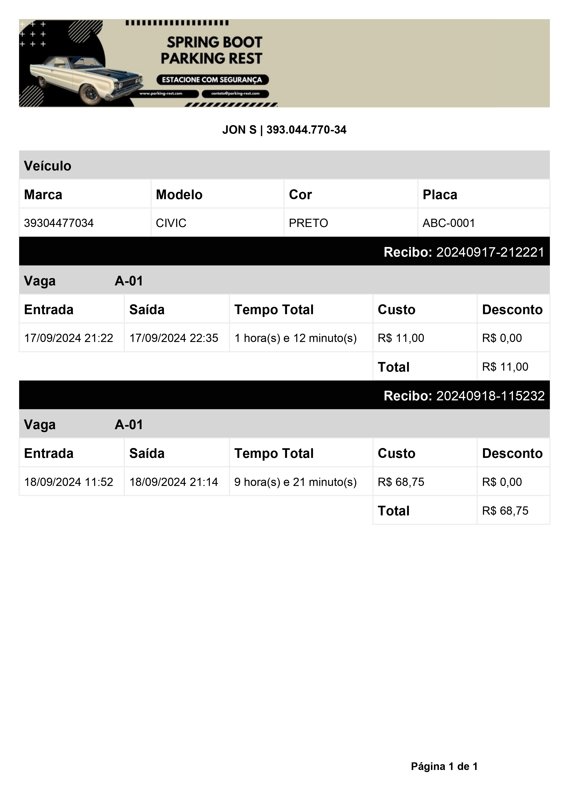

# Demo Park API

## Descrição

O **Demo Park API** é uma aplicação desenvolvida em **Java 17** usando **Spring Boot** para o gerenciamento de um
estacionamento. A API oferece operações de CRUD (Create, Read, Update, Delete) para gerenciar os dados dos veículos e
usuários, com exceção da operação de deleção, priorizando a integridade e segurança dos dados.

A API também inclui funcionalidades para geração de relatórios em **PDF** utilizando o **JasperSoft Studio** e está
documentada com **Swagger** para facilitar o uso e teste dos endpoints. Além disso, testes **end-to-end** foram
realizados para garantir a integridade e funcionalidade completa da aplicação.

<p align="center">
  
</p>

## Funcionalidades

- **Cadastro de veículos e usuários**: Permite a criação de novos registros no sistema.
- **Consulta de registros**: Recuperação de informações de veículos e usuários cadastrados.
- **Atualização de dados**: Modificação dos registros existentes no sistema.
- **Geração de PDFs**: Criação de relatórios personalizados em formato PDF usando **JasperSoft Studio**.
- **Autenticação e Autorização**: Controle de acesso às funcionalidades da API, garantindo que apenas usuários
  autenticados e autorizados possam realizar determinadas operações.
- **Documentação e Testes com Swagger**: Interface interativa para explorar e testar a API diretamente pelo navegador.
- **Testes End-to-End**: Validação da funcionalidade completa da API, desde o cadastro até a geração de relatórios e
  controle de acesso, garantindo que todos os fluxos funcionem conforme o esperado.
- **Internacionalização (i18n)**: Suporte para múltiplos idiomas, permitindo a personalização das mensagens da API de
  acordo com a configuração de localidade do usuário. Idiomas suportados: Português, Inglês e Espanhol.

## Tecnologias Utilizadas

- **Java 17**: Linguagem de programação utilizada no desenvolvimento da aplicação.
- **Spring Boot**: Framework para facilitar a criação da aplicação, com recursos de injeção de dependência, configuração
  automática, entre outros.
- **Spring Security**: Implementação de autenticação e autorização para proteger a aplicação.
- **Maven**: Ferramenta de gerenciamento de dependências e automação de build.
- **MySQL Workbench**: Ferramenta para modelagem e administração do banco de dados MySQL.
- **MySQL**: Banco de dados utilizado para armazenamento dos dados da aplicação.
- **JasperSoft Studio**: Ferramenta para a criação de relatórios em PDF.
- **Swagger**: Documentação e testes interativos da API.
- **Padrão Builder**: Implementação para a construção de objetos complexos de forma controlada e segura.

## Padrão de Arquitetura: Camadas

A aplicação segue o **padrão de arquitetura em camadas**, onde cada camada tem responsabilidades bem definidas. Isso
promove a separação de responsabilidades e facilita a manutenção e evolução da aplicação.

### Estrutura de Camadas:

- **Controller**: Responsável por receber as requisições e retornar as respostas adequadas.
- **Service**: Contém a lógica de negócios da aplicação, sendo responsável pelas regras de funcionamento.
- **Repository**: Realiza a comunicação com o banco de dados para persistir ou recuperar dados.
- **Model**: Representa as entidades do sistema.

## Como Executar o Projeto

1. Clone o repositório:
   ```bash
   git clone https://github.com/sirkaue/demo-park-api.git
